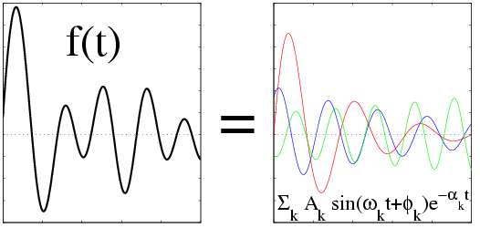

# Harminv
[](https://travis-ci.org/stevengj/harminv)

Harmonic Inversion of Time Signals by the Filter Diagonalization Method (FDM),
implemented by [Steven G. Johnson](http://math.mit.edu/~stevenj/), Massachusetts Institute of Technology.

## Introduction

Harminv is a free program (and accompanying library) to solve the
problem of "harmonic inversion."  Given a discrete, finite-length
signal that consists of a sum of finitely-many sinusoids (possibly
exponentially decaying), it determines the frequencies, decay
constants, amplitudes, and phases of those sinusoids.

It can, in principle, provide much better accuracy than
straightforward FFT based methods, essentially because it assumes a
specific form for the signal.  (Fourier transforms, in contrast,
attempt to represent *any* data as a sum of sinusoidal components.)

We use a low-storage **"filter diagonalization method"** (FDM) for
finding the sinusoids near a given frequency interval, described in:

* [V. A. Mandelshtam](http://www.faculty.uci.edu/profile.cfm?faculty_id=4582) and H. S. Taylor, ["Harmonic inversion of time
  signals,"](http://dx.doi.org/10.1063/1.475324) J. Chem. Phys., vol. 107, no. 17, p. 6756-6769 (Nov. 1
  1997).  See also erratum, ibid, vol. 109, no. 10, p. 4128 (Sep. 8
  1998).

This kind of spectral analysis has wide applications in many areas of
physics and engineering, as well as other fields.  For example, it
could be used to extract the vibrational or "eigen" modes of a system
from its response to some stimulus, and also their rates of decay in
dissipative systems.  FDM has been applied to analyze, e.g., NMR
experimental data and numerical simulations of quantum mechanics or [electromagnetism](http://dx.doi.org/doi:10.1016/j.cpc.2009.11.008).  In general, it is useful when you know on physical grounds that your system consists of a **small number of decaying & oscillating modes in the bandwidth of interest,** plus a limited amount of noise, and is **not appropriate to analyze completely arbitrary waveforms.**

## Download

The latest version is Harminv 1.4, which can be downloaded in
source-code form at:

 * <http://ab-initio.mit.edu/harminv/harminv-1.4.tar.gz>

What's new in each version is described in the [Harminv release
notes](NEWS.md). Harminv is distributed under
the [GNU GPL](http://www.gnu.org/copyleft/gpl.html) and comes with **NO
WARRANTY** (see the license for more details). Development sources can
be found on GitHub:

 * [Harminv GitHub repository](https://github.com/stevengj/harminv)

It would be courteous of you to **cite Harminv** and its author in any
publication for which you find it useful, in addition to citing a
Mandelshtam reference (either the one above or the review article
below).

To install Harminv, please see our [installation instructions](doc/installation.md).

If you use [Debian GNU/Linux](https://en.wikipedia.org/wiki/Debian)
or [Ubuntu](https://en.wikipedia.org/wiki/Ubuntu_(operating_system)), you can
use the Debian package of harminv,
packaged by Loic Le Guyader.

A Python interface to Harminv was developed by Aaron O'Leary:
[pharminv](https://github.com/aaren/harminv).

Please file bug reports or feature requests as [harminv Github
issues](https://github.com/stevengj/harminv/issues).

## Usage

Most people will use Harminv via the stand-alone `harminv` program
[as described in its manual](doc/harminv-man.md).  To briefly summarize,
it takes a sequence of numbers (real or complex) from standard input
and a range of frequencies to search and outputs the frequencies it
finds.

It is also possible to [call Harminv as library](doc/library.md)
from a C/C++ program.

## Test Cases/Examples

The input for harminv should just be a list of numbers (real or
complex), one per line, as described in the harminv man page.

You can use the program `sines`, in the harminv source directory, to
test harminv and to generate example inputs.  The sines program
generates a signal consisting of a sum of decaying sinuoids with
specified complex frequencies.  For example,
```
./sines 0.1+0.01i 0.08+0.001i
```
generates 10000 data points consisting of a signal with complex
frequencies 0.1+0.01i and 0.08+0.001i, with amplitudes 1 and 2
respectively, sampled at time intervals dt=1.0.  If we input this data
into harminv, it should be able to extract these frequencies, decay
rates, and amplitudes.
```
./sines 0.1+0.01i 0.08+0.001i | harminv 0.05-0.15
```
The output should be something like:
```
frequency, decay constant, Q, amplitude, phase, error
0.08, 1.000000e-03, 251.327, 2, 3.14159, 1.064964e-16
0.1, 1.000000e-02, 31.4159, 1, -4.31228e-15, 2.265265e-15
```
as expected.  Note that we have to pass harminv a range of frequencies
to search, here 0.05-0.15, which shouldn't be too large and should
normally not include 0.  In most cases, one would also specify the
sampling interval to harminv via `harminv -t <dt>`, but in this case we
don't need to because `-t 1.0` is the default.

Run `./sines -h` to get more options.

# Algorithm

Essentially, FDM works by considering the time-series to be the
autocorrelation function of a fictitious dynamical system, such that
the problem of finding the frequencies and decay constants is
re-expressed as the problem of finding the eigenvalues of the
complex-symmetric time-evolution operator of this system.  The key
point is that, if you are only interested in frequencies within a
known band-limited region, the matrix elements of this operator can be
expressed purely in terms of Fourier transforms (or, really, z
transforms) of your time-series.  Then, one can simply diagonalize a
small matrix (size proportional to the bandwidth and the number of
frequencies) to find the desired result.

In general, for M data points and J frequencies, the time required is
O(M J + J^3).  The main point of the algorithm is not so much speed,
however, but the effective solution of a very ill-conditioned fitting
problem.  (Even closely-spaced frequencies and/or weak decay rates can
be resolved much more reliably by FDM than by straightforward fits of
the data or its spectrum.)

See also:

* Rongqing Chen and Hua Guo, "Efficient calculation of matrix
  elements in low storage filter diagonalization," J. Chem. Phys.,
  vol. 111, no. 2, p. 464-471(Jul. 8 1999).

* Michael R. Wall and Daniel Neuhauser, "Extraction, through
  filter-diagonalization, of general quantum eigenvalues or classical
  normal mode frequencies from a small number of residues or a
  short-time segment of a signal. I. Theory and application to a
  quantum-dynamics model," J. Chem. Phys., 102, no. 20, p. 8011-8022
  (May 22 1995).

* J. Chen and V. A. Mandelshtam, "Multiscale filter diagonalization method for spectral analysis of noisy data with nonlocalized features," J. Chem. Phys. 112 (10), 4429-4437 (2000).

* V. A. Mandelshtam, "FDM: the filter diagonalization method for data processing in NMR experiments," Progress in Nuclear Magnetic Resonance Spectroscopy 38, 159-196 (2001). (*Review article.*)

* V. A. Mandelshtam, "On harmonic inversion of cross-correlation
  functions by the filter diagonalization method," J. Theoretical and
  Computational Chemistry 2 (4), 497-505 (2003).
